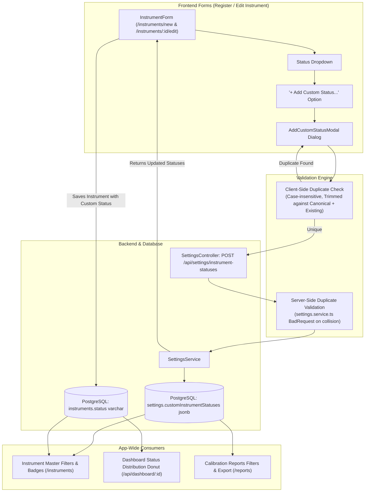

# Phase Plan: Custom Instrument Status with Duplicate Validation & App-Wide Propagation

**Phase Slug:** `01-custom-instrument-status`  
**Target:** Register Instrument (`/instruments/new`), Edit Instrument (`/instruments/:id/edit`), Master Inventory (`/instruments`), Dashboard (`/`), and Reports (`/reports`).  
**Mode:** Tracer-First, Reversible, Strict Duplicate Validation  

---

## 1. Executive Summary & Goals

The user requested the ability to enter **Custom Status** values for instruments:
1. **Interactive Entry in Forms**: In both **Register Instrument** and **Edit Instrument**, allow users to define and select custom statuses directly from the Status input/dropdown.
2. **Duplicate Prevention**: Strictly validate that any custom status entered does **NOT** match an existing value (neither standard canonical statuses like `OK`, `Upcoming Calibration (10 days before )`, `Sent for Calibration`, `Overdue`, nor previously added custom statuses). If a duplicate is detected (case-insensitive and trimmed), reject entry and notify the user.
3. **Application-Wide Propagation**: Custom statuses must persist per company/tenant and automatically propagate across:
   - **Instrument Master Table & Filters** (`/instruments`)
   - **Analytics Dashboard Status Distribution & Drill-Down** (`/`)
   - **Reports Status Filtering & Previews** (`/reports`)
   - **Status Badges** throughout the UI

---

## 2. Architecture & Data Flow



---

## 3. Scope & Requirements Matrix

| ID | Requirement | Implementation Target | Verification Method |
|---|---|---|---|
| **REQ-1** | Custom Status Entry in Forms | [InstrumentForm.tsx](file:///e:/Gaugemaster/gaugemaster/frontend/src/pages/InstrumentForm.tsx) & [DynamicForm.tsx](file:///e:/Gaugemaster/gaugemaster/frontend/src/components/DynamicForm.tsx) | "+ Add Custom Status..." option in dropdown opens dialog |
| **REQ-2** | Strict Duplicate Validation | Client-side dialog + Backend [settings.service.ts](file:///e:/Gaugemaster/gaugemaster/backend/src/settings/settings.service.ts) | Attempting to enter "OK", "ok", "Overdue", or existing custom status blocks with error message |
| **REQ-3** | Tenant-Scoped Persistence | [setting.entity.ts](file:///e:/Gaugemaster/gaugemaster/backend/src/settings/entities/setting.entity.ts) `customInstrumentStatuses` jsonb + TypeORM migration | Stored per `companyId` and loaded on form mount |
| **REQ-4** | Auto-Selection on Creation | [InstrumentForm.tsx](file:///e:/Gaugemaster/gaugemaster/frontend/src/pages/InstrumentForm.tsx) React Hook Form `setValue` | Newly created status is immediately selected in the form |
| **REQ-5** | Instrument Master Filter & Badge | [Instruments.tsx](file:///e:/Gaugemaster/gaugemaster/frontend/src/pages/Instruments.tsx) & [StatusBadge.tsx](file:///e:/Gaugemaster/gaugemaster/frontend/src/components/common/StatusBadge.tsx) | Master table filter includes custom status; rows display custom status badge |
| **REQ-6** | Dashboard Donut & Count Integration | [dashboard.service.ts](file:///e:/Gaugemaster/gaugemaster/backend/src/dashboard/dashboard.service.ts) & [DashboardPieChart.tsx](file:///e:/Gaugemaster/gaugemaster/frontend/src/components/DashboardPieChart.tsx) | Donut chart groups and displays custom statuses with dynamic colors |
| **REQ-7** | Reports Integration | [Reports.tsx](file:///e:/Gaugemaster/gaugemaster/frontend/src/pages/Reports.tsx) & [instruments.service.ts](file:///e:/Gaugemaster/gaugemaster/backend/src/instruments/instruments.service.ts#L141) | Status filter in Reports includes custom status |

---

## 4. Canonical Statuses & Duplicate Rules

### Canonical Status Set
The standard statuses that cannot be duplicated:
1. `OK`
2. `Upcoming Calibration (10 days before )`
3. `Sent for Calibration`
4. `Overdue`

### Normalization & Match Algorithm
```ts
function isDuplicateStatus(candidate: string, existingList: string[]): boolean {
  const normalizedCandidate = candidate.trim().toLowerCase();
  if (!normalizedCandidate) return true; // empty strings rejected
  return existingList.some(item => item.trim().toLowerCase() === normalizedCandidate);
}
```
If `isDuplicateStatus` returns `true`:
- Error message: `"Status '[candidate]' already exists. Please enter a unique status name."`
- Creation is blocked both in UI and API.

---

## 5. Detailed Task Breakdown

### Wave 1: Backend Persistence & API (Tracer)
- **Task 1.1: Database Migration & Entity Update**
  - Create reversible TypeORM migration `AddCustomInstrumentStatusesToSettings`.
  - Add `customInstrumentStatuses: string[]` to [setting.entity.ts](file:///e:/Gaugemaster/gaugemaster/backend/src/settings/entities/setting.entity.ts) with `@Column({ type: "jsonb", nullable: true, default: () => "'[]'" })`.
  - Update DTOs in [create-setting.dto.ts](file:///e:/Gaugemaster/gaugemaster/backend/src/settings/dto/create-setting.dto.ts) and [update-setting.dto.ts](file:///e:/Gaugemaster/gaugemaster/backend/src/settings/dto/update-setting.dto.ts).
- **Task 1.2: Settings Service & Controller Methods**
  - In [settings.service.ts](file:///e:/Gaugemaster/gaugemaster/backend/src/settings/settings.service.ts), add:
    - `getCustomInstrumentStatuses(companyId: string): Promise<string[]>`
    - `addCustomInstrumentStatus(companyId: string, status: string): Promise<{ success: boolean; statuses: string[] }>`
    - Server-side duplicate validation against canonical statuses and existing custom statuses (throws `BadRequestException` on collision).
  - In [settings.controller.ts](file:///e:/Gaugemaster/gaugemaster/backend/src/settings/settings.controller.ts), expose:
    - `GET /api/settings/instrument-statuses?companyId=...`
    - `POST /api/settings/instrument-statuses`
- **Task 1.3: Update `findFilterParams` in Instruments Service**
  - In [instruments.service.ts](file:///e:/Gaugemaster/gaugemaster/backend/src/instruments/instruments.service.ts#L141):
    - Retrieve company settings to get `customInstrumentStatuses`.
    - Combine `[...canonicalStatuses, ...instruments.map(i => i.status), ...customInstrumentStatuses]` with case-insensitive deduplication.
    - Ensures Master and Reports filter endpoints automatically serve all custom statuses.

### Wave 2: Frontend Custom Status Component & Form Integration
- **Task 2.1: Add Frontend Actions for Custom Status**
  - In [instrumentActions.ts](file:///e:/Gaugemaster/gaugemaster/frontend/src/lib/instrumentActions.ts):
    - `getCustomInstrumentStatuses(companyId: string): Promise<string[]>`
    - `addCustomInstrumentStatus(companyId: string, status: string): Promise<string[]>`
- **Task 2.2: Create `AddCustomStatusModal` Dialog Component**
  - New component in `frontend/src/components/instruments/AddCustomStatusModal.tsx`:
    - Controlled Dialog with input field.
    - Real-time duplicate error banner (checks input against canonical statuses + current custom statuses).
    - Save button disabled when input is empty or a duplicate.
    - Loading indicator during submission.
- **Task 2.3: Integrate into `InstrumentForm.tsx` & `DynamicForm.tsx`**
  - In [InstrumentForm.tsx](file:///e:/Gaugemaster/gaugemaster/frontend/src/pages/InstrumentForm.tsx):
    - Fetch custom statuses on component mount using `user.companyId`.
    - Pass custom statuses to `computeStatusOptions`.
    - Provide "+ Add Custom Status..." item in the status options list and/or action trigger.
    - Wire `AddCustomStatusModal` to save, update local state, and immediately call `setValue("status", newStatus, { shouldValidate: true, shouldDirty: true })`.
    - Support both Register (`/instruments/new`) and Edit (`/instruments/:id/edit`) workflows.

### Wave 3: Master Data, Dashboard & Reports Propagation
- **Task 3.1: Instrument Master (`/instruments`) Filter & Display**
  - Verify `StatusFillter` receives custom statuses from `getFilterParams`.
  - Enhance [StatusBadge.tsx](file:///e:/Gaugemaster/gaugemaster/frontend/src/components/common/StatusBadge.tsx) to render custom statuses with a refined modern badge (clean tag icon or subtle accent dot) so custom badges look native.
- **Task 3.2: Analytics Dashboard Donut & Charts**
  - Verify [dashboard.service.ts](file:///e:/Gaugemaster/gaugemaster/backend/src/dashboard/dashboard.service.ts#L453) aggregates instruments with custom status in `statusDistribution`.
  - Verify [DashboardPieChart.tsx](file:///e:/Gaugemaster/gaugemaster/frontend/src/components/DashboardPieChart.tsx) assigns vibrant contrasting colors from `DEFAULT_COLORS` and slice-clicking correctly navigates to `/instruments?status={customStatus}`.
- **Task 3.3: Reports (`/reports`) Verification**
  - Verify `Reports.tsx` status filter dropdown shows custom statuses and allows filtering previews and downloads.

### Wave 4: Validation & Quality Gates
- **Task 4.1: Edge Cases & Validation Testing**
  - Case: User tries entering `"ok"` (lowercase) -> Blocked with `"Status 'OK' already exists"`.
  - Case: User tries entering `"  Overdue  "` (leading/trailing whitespace) -> Blocked with `"Status 'Overdue' already exists"`.
  - Case: User enters existing custom status `"Under Maintenance"` -> Blocked with `"Status 'Under Maintenance' already exists"`.
  - Case: User enters valid unique status `"In Quarantine"` -> Successfully saved to DB, selected in form, saved on instrument, visible on Dashboard & Master.
- **Task 4.2: Type Safety & Compilation**
  - Run `npx tsc --noEmit` in `backend`.
  - Run `npx tsc --noEmit` in `frontend`.

---

## 6. Verification Commands & Acceptance Criteria

```bash
# Backend verification
cd e:\Gaugemaster\gaugemaster\backend
npm run build # or npx tsc --noEmit

# Frontend verification
cd e:\Gaugemaster\gaugemaster\frontend
npx tsc --noEmit
```

### Acceptance Checklist
- [ ] In `/instruments/new` (Register), Status dropdown has "+ Add Custom Status..." option.
- [ ] In `/instruments/:id/edit` (Edit), Status dropdown has "+ Add Custom Status..." option.
- [ ] Entering an existing canonical status (`OK`, `Overdue`, etc.) is rejected with an explicit error message.
- [ ] Entering an already existing custom status is rejected with an explicit error message.
- [ ] Submitting a unique custom status saves it in `settings` for the tenant and selects it in the current form.
- [ ] Saving the instrument stores the custom status in PostgreSQL `instruments.status`.
- [ ] Instrument Master (`/instruments`) shows the custom status badge in the table and lists it in the Status filter dropdown.
- [ ] Dashboard (`/`) includes the custom status in the status distribution donut chart and allows drill-down.
- [ ] Zero TypeScript errors across both backend and frontend.
