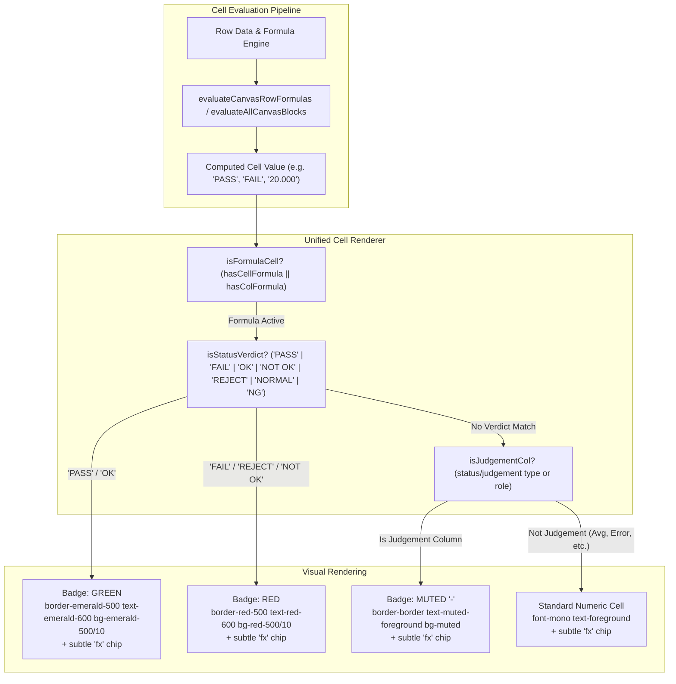

# Phase Plan: Permanent Fix for Formula-Driven Judgement Pass/Fail Badge Rendering

**Phase Slug:** `02-calibration-formula-judgement-badge-fix`  
**Target:** Calibration Wizard (`/calibration/new`), Visual Canvas Tables, Template Builder (`/templates/builder`), Trial Run Modal, and Certificate Previews.  
**Mode:** Tracer-First, Non-Breaking, Universal Metrology Rendering Guarantee  
**Status:** ✅ COMPLETED & FULLY VERIFIED (Production Build Passed, 159 + 57 + 3 Tests Passed)

---

## 1. Executive Summary & Problem Diagnosis

### The Production Issue
In the **Calibration Wizard** (`localhost:8080/calibration/new`), for template **33. KNIFE EDGE VERNIER CALIPER CALIBRATION REPORT** (and any other template where Judgement / Status is calculated via formula):
- In the **Template Builder**, `PASS` and `FAIL` render with rich green and red badges.
- In the **Calibration Wizard Data Entry Tables**, when a Judgement column uses a cell formula (`row.cellFormulas[col.id]`) or column formula (`col.formula`), row 1 shows `fx PASS` and row 2 shows `fx FAIL` as **plain unstyled text** with a formula indicator, without any green or red badge coloring (highlighted in user's production screenshot).

### Root Cause Analysis
In [CalibrationWizard.tsx](file:///e:/Gaugemaster/gaugemaster/frontend/src/pages/CalibrationWizard.tsx):
1. In both **Vertical Tables** (line 4772) and **Horizontal Tables** (line 3919):
   ```tsx
   const cellFormula = row.cellFormulas?.[col.id];
   const hasCellFormula = typeof cellFormula === "string" && cellFormula.trim().length > 0;
   const hasColFormula = col.type === "formula" && typeof col.formula === "string" && col.formula.trim().length > 0;
   const isFormulaCell = hasCellFormula || hasColFormula;

   if (isFormulaCell) {
     const val = row[col.id] ?? "-";
     return (
       <td key={col.id} className="py-0.5 px-1 font-bold text-foreground text-[11px] bg-primary/5">
         <div className="flex items-center justify-center gap-1" title={hasCellFormula ? `Formula: ${cellFormula}` : col.formula}>
           <span className="text-[9px] px-1 py-0.2 bg-primary/10 text-primary font-mono rounded">fx</span>
           <span>{val !== undefined && val !== null && val !== "" ? String(val) : "-"}</span>
         </div>
       </td>
     );
   }
   ```
2. The block `if (isFormulaCell)` is executed **before** the judgement column check (`isJudgementCol` at line 4807 and line 3992).
3. Inside `if (isFormulaCell)`:
   - It directly returns a `<td>` containing plain `<span>{val}</span>`.
   - It never evaluates whether `val` is `"PASS"`, `"FAIL"`, `"OK"`, `"NOT OK"`, `"REJECT"`, or `"NORMAL"`.
   - It never checks whether `isJudgementCol` is true.
4. As a result, formula-driven judgement cells (cell formulas or column formulas) are intercepted and bypass the Badge renderer (`Badge variant="outline" className="border-emerald-500 ..."`), displaying raw unstyled text next to `fx`.

---

## 2. Solution Architecture & Permanent Fix



---

## 3. Scope & Requirements Matrix

| ID | Requirement | Implementation Target | Verification Method |
|---|---|---|---|
| **REQ-1** | Permanent Pass/Fail Badge for Formula Judgement (Vertical Tables) | [CalibrationWizard.tsx](file:///e:/Gaugemaster/gaugemaster/frontend/src/pages/CalibrationWizard.tsx#L4772-L4785) | In `/calibration/new` with template 33, row 1 (`fx PASS`) displays Green badge, row 2 (`fx FAIL`) displays Red badge |
| **REQ-2** | Permanent Pass/Fail Badge for Formula Judgement (Horizontal Tables) | [CalibrationWizard.tsx](file:///e:/Gaugemaster/gaugemaster/frontend/src/pages/CalibrationWizard.tsx#L3919-L3935) | Horizontal Canvas tables with formula judgement render Green for PASS and Red for FAIL |
| **REQ-3** | Formula Chip (`fx`) Preservation | [CalibrationWizard.tsx](file:///e:/Gaugemaster/gaugemaster/frontend/src/pages/CalibrationWizard.tsx) | The subtle `fx` badge is preserved alongside the status badge with formula expression tooltip on hover |
| **REQ-4** | Non-Formula Cells Integrity | [CalibrationWizard.tsx](file:///e:/Gaugemaster/gaugemaster/frontend/src/pages/CalibrationWizard.tsx) & [CanvasTemplateEditor.tsx](file:///e:/Gaugemaster/gaugemaster/frontend/src/components/calibration/CanvasTemplateEditor.tsx) | Numeric calculation columns (Avg, Error, Deviation) and manual Judgement controls remain unaffected |
| **REQ-5** | Trial Run Modal Alignment | [TrialRunModal.tsx](file:///e:/Gaugemaster/gaugemaster/frontend/src/components/calibration/template-management/TrialRunModal.tsx#L511-L516) | Formula columns evaluating to PASS / FAIL in Trial Run modal also display proper green / red badges |
| **REQ-6** | Universal Matcher Rule | Metrology verdict matcher | Supports all standard industrial terms: `PASS`, `OK`, `NORMAL`, `ACCEPT` (Green) and `FAIL`, `REJECT`, `NOT OK`, `NG` (Red) |

---

## 4. Implementation Details

### A. Dedicated Status Matcher & Badge Helper
Define a reusable helper inside `CalibrationWizard.tsx` (and shareable):
```tsx
const getStatusVerdict = (val: any) => {
  if (val === undefined || val === null) return null;
  const str = String(val).trim().toUpperCase();
  if (str === "PASS" || str === "OK" || str === "NORMAL" || str === "ACCEPT") {
    return "pass";
  }
  if (str === "FAIL" || str === "NOT OK" || str === "REJECT" || str === "NG") {
    return "fail";
  }
  return null;
};
```

### B. Vertical Table Cell Rendering in `CalibrationWizard.tsx`
Replace lines 4774-4784 with:
```tsx
if (isFormulaCell) {
  const val = row[col.id] ?? "-";
  const verdict = getStatusVerdict(val);
  const isJudgementLike = isJudgementCol || verdict !== null;

  return (
    <td key={col.id} className="py-0.5 px-1 font-bold text-foreground text-[11px] bg-primary/5 text-center">
      <div className="flex items-center justify-center gap-1" title={hasCellFormula ? `Formula: ${cellFormula}` : col.formula}>
        <span className="text-[9px] px-1 py-0.2 bg-primary/10 text-primary font-mono rounded shrink-0">fx</span>
        {isJudgementLike ? (
          <Badge
            variant="outline"
            className={`text-[9px] font-bold py-0 px-1.5 ${
              verdict === "pass"
                ? "border-emerald-500 text-emerald-600 bg-emerald-500/10 dark:bg-emerald-950/60 dark:text-emerald-400"
                : verdict === "fail"
                  ? "border-red-500 text-red-600 bg-red-500/10 dark:bg-rose-950/60 dark:text-red-400"
                  : "border-border text-muted-foreground bg-muted"
            }`}
          >
            {val !== undefined && val !== null && val !== "" ? String(val) : "-"}
          </Badge>
        ) : (
          <span>{val !== undefined && val !== null && val !== "" ? String(val) : "-"}</span>
        )}
      </div>
    </td>
  );
}
```

### C. Horizontal Table Cell Rendering in `CalibrationWizard.tsx`
Apply the matching enhancement to lines 3921-3934 for horizontal tables:
```tsx
if (isFormulaCell) {
  const val = row[col.id] ?? "-";
  const verdict = getStatusVerdict(val);
  const isJudgementLike = isJudgementCol || verdict !== null;

  return (
    <td
      key={rIdx}
      style={{ width: dataColWidthVal, minWidth: dataColWidthVal }}
      className="py-0.5 px-1 font-bold text-foreground text-[11px] bg-primary/5 text-center"
    >
      <div className="flex items-center justify-center gap-1" title={hasCellFormula ? `Formula: ${cellFormula}` : col.formula}>
        <span className="text-[9px] px-1 py-0.2 bg-primary/10 text-primary font-mono rounded shrink-0">fx</span>
        {isJudgementLike ? (
          <Badge
            variant="outline"
            className={`text-[9px] font-bold py-0 px-1.5 ${
              verdict === "pass"
                ? "border-emerald-500 text-emerald-600 bg-emerald-500/10 dark:bg-emerald-950/60 dark:text-emerald-400"
                : verdict === "fail"
                  ? "border-red-500 text-red-600 bg-red-500/10 dark:bg-rose-950/60 dark:text-red-400"
                  : "border-border text-muted-foreground bg-muted"
            }`}
          >
            {val !== undefined && val !== null && val !== "" ? String(val) : "-"}
          </Badge>
        ) : (
          <span>{val !== undefined && val !== null && val !== "" ? String(val) : "-"}</span>
        )}
      </div>
    </td>
  );
}
```

### D. Aligning `TrialRunModal.tsx`
In `TrialRunModal.tsx` (lines 511-516 and 685-690), when `col.type === "formula"`, check if `row[col.id]` is a verdict and render the status badge with `(fx)` indicator.

---

## 5. Risk Assessment & Safety Guardrails

| Risk | Likelihood | Impact | Mitigation Strategy |
|---|---|---|---|
| Formula calculation regression | None | High | Only the visual JSX render layer is modified; formula parsing and mathematical computation in `formulaEngine.ts` are untouched. |
| Non-status formula cells getting badges | Low | Low | Strict condition checks `verdict !== null || isJudgementCol`. Pure numeric formulas like Avg `50.026` or Error `0.026` never match and continue rendering as plain numeric text. |
| Empty / null value rendering | None | Low | Handles `-`, `null`, `undefined` cleanly by defaulting to muted `-` badge or plain `-`. |
| Dark mode styling | None | Low | Badges use standard Tailwind dark-mode classes matching the rest of the application. |

---

## 6. Verification & Test Plan

1. **Static Analysis & Type Checking**:
   - Run `npx tsc --noEmit` in `frontend` to verify 0 type errors.
2. **Automated Unit Tests**:
   - Run `npm test` on frontend calibration and formula test suites (`formulaEngine.test.ts`, `calibrationTemplateAndWizard.test.ts`).
3. **Browser / UI Verification**:
   - Navigate to `/calibration/new` with template `33. KNIFE EDGE VERNIER CALIPER CALIBRATION REPORT`.
   - Enter readings that yield a Pass: verify green `PASS` badge next to `fx`.
   - Enter readings that yield a Fail: verify red `FAIL` badge next to `fx`.
   - Verify non-status formula columns (`Avg`, `Error`) continue rendering numeric values without badges.
