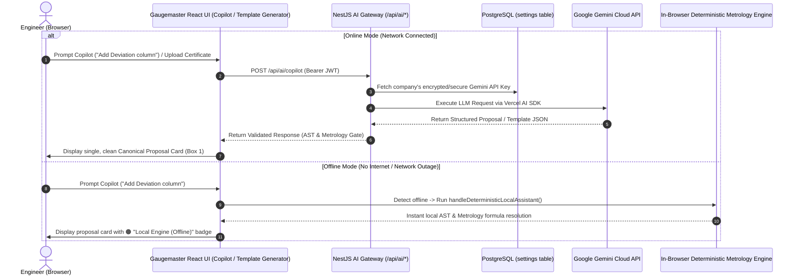

# Senior Frontend Architecture Review & Implementation Plan: Zero-Risk Global AI Key & Copilot Modernization

**Skill Activated:** `/senior-frontend`  
**Problem Statement:** Storing API keys in browser `localStorage` or making direct client-to-Google API calls exposes the API key in browser storage, JavaScript memory, and browser Network tabs (query parameters `?key=AIzaSy...`). Anyone opening Chrome DevTools (F12) can inspect and copy the key.

---

## Senior Frontend Architectural Review: How to Access the API Key Globally with ZERO Risk

### Why Client-Side Key Storage is a Security Vulnerability
In a Single Page Application (React Vite):
1. **`localStorage` / `sessionStorage`:** Accessible by any script running on the page. Vulnerable to XSS or rogue browser extensions.
2. **Client-side `fetch('https://generativelanguage.googleapis.com/...key=...')`:** The raw API key is broadcast in the browser's Network tab in plaintext. Anyone using the workstation can extract it.
3. **Frontend `.env` (`VITE_GEMINI_API_KEY`):** Bundled directly into public JavaScript bundles (`dist/assets/*.js`) during Vite compilation.

---

### The Enterprise Best-Practice Solution: Backend AI Gateway (BFF - Backend for Frontend)

Instead of the browser holding the key and talking directly to Google, we implement the **Backend AI Proxy Gateway**:



### Key Security & Architecture Benefits:
1. **Zero Key Exposure (100% Secure):**
   - The Google Gemini API key **NEVER enters the browser**.
   - It is stored **only** in the backend PostgreSQL `settings` table (or server environment variable).
   - In the Settings page, when an admin enters the key, it is sent once over HTTPS (`POST /api/settings/ai-config`) and masked (`AIzaSy•••••••••••••••4EA`) on subsequent reads.
2. **Global Access for All Users & Workstations:**
   - Any authorized user in the company automatically gets AI capabilities across the entire application without ever knowing or entering the API key!
3. **Vercel AI SDK Native Architecture:**
   - Vercel AI SDK (`ai`, `@ai-sdk/google`) is purpose-built to run on backend API handlers and stream or return structured responses to `@ai-sdk/react`.
4. **Resilient Dual-Engine (Online & Offline):**
   - If the backend/internet is unreachable, the frontend automatically falls back to `handleDeterministicLocalAssistant` in the browser, ensuring ISO 17025 template editing and formula validation work with zero downtime.
5. **Live Status Indicator:**
   - Real-time availability badge (🟢 Cloud AI Online vs 🟠 Local Engine Offline) displayed right in the UI headers.

---

## Proposed Changes

### Component 1: Backend AI Gateway & Secure Key Storage (NestJS)

#### [MODIFY] [setting.entity.ts](file:///e:/Gaugemaster/gaugemaster/backend/src/settings/entities/setting.entity.ts)
- Add `aiConfig` jsonb column to the `Setting` entity:
  ```typescript
  @Column({ type: "jsonb", nullable: true })
  aiConfig: {
    apiKey?: string;
    defaultModel?: string;
    enabled?: boolean;
  };
  ```

#### [NEW] [ai.controller.ts](file:///e:/Gaugemaster/gaugemaster/backend/src/settings/ai.controller.ts)
- Implement secure AI Gateway routes with JWT authentication (`@UseGuards(AuthGuard('jwt'), PermissionsGuard)`):
  - `POST /api/ai/copilot`: Handles Copilot chat requests using company-stored key + Vercel AI SDK (`ai` / `@ai-sdk/google`).
  - `POST /api/ai/generate-template`: Handles template extraction from PDF, Word, Excel, or Image.
  - `POST /api/ai/test-connection`: Tests the company's configured key directly from the server to Google and returns status & available models.
  - `GET /api/ai/status`: Returns current AI configuration status (e.g. `{ configured: true, model: "gemini-2.0-flash" }`) without exposing the secret key.

#### [NEW] [ai.service.ts](file:///e:/Gaugemaster/gaugemaster/backend/src/settings/ai.service.ts)
- Encapsulates Gemini API calls using Vercel AI SDK and the company's stored API key.
- Validates formulas with AST before returning to the frontend.

#### [MODIFY] [settings.module.ts](file:///e:/Gaugemaster/gaugemaster/backend/src/settings/settings.module.ts)
- Register `AiController` and `AiService`.

---

### Component 2: Frontend Global Settings & Live Status Indicator

#### [NEW] [AiConfig.tsx](file:///e:/Gaugemaster/gaugemaster/frontend/src/pages/settings/AiConfig.tsx)
- Premium AI Settings UI under `Settings -> System Preferences`:
  - Input field for Google Gemini API key with masked preview (`AIzaSy•••••••••••••••4EA`) when already saved.
  - **"Test Connection" button**: Calls `/api/ai/test-connection` to verify connectivity, latency, and available models directly from the server.
  - **Model selector**: `gemini-2.0-flash` (Recommended), `gemini-1.5-flash`, `gemini-1.5-pro`.
  - **Save button**: Stores the key in the database with zero client-side persistence in `localStorage`.

#### [MODIFY] [Settings.tsx](file:///e:/Gaugemaster/gaugemaster/frontend/src/pages/Settings.tsx)
- Add the `AI & Copilot Configuration` tab with `Sparkles` icon.

#### [NEW] [AiConnectionBadge.tsx](file:///e:/Gaugemaster/gaugemaster/frontend/src/components/calibration/template-management/AiConnectionBadge.tsx)
- Reusable UI component displaying live connection & engine status:
  - 🟢 **Online (Gemini 2.0 Flash)**: Backend AI Gateway is active and responsive.
  - 🟠 **Local Engine (Offline)**: Offline or no key configured; deterministic in-browser metrology engine active.
  - 🔴 **Key Not Configured / Quota Exceeded**: Provides a direct link to Settings.

---

### Component 3: AI Smart Template Generator (Preserve All Features + Zero Risk)

#### [MODIFY] [AiTemplateGeneratorModal.tsx](file:///e:/Gaugemaster/gaugemaster/frontend/src/components/calibration/template-management/AiTemplateGeneratorModal.tsx)
- Replace client-side Gemini call with backend AI Gateway `httpClient.post('/api/ai/generate-template', payload)`.
- If key is already configured on the server, the modal shows the `AiConnectionBadge` (🟢 Cloud AI Ready) and does **not** prompt the user to type an API key.
- If the admin hasn't configured a key yet, an inline option allows saving it directly to the backend database.
- 100% preserves existing features:
  - PDF document processing
  - Word document processing (.docx)
  - Excel sheet parsing (.xlsx / .xls with formula extraction)
  - Image OCR
  - Instant Accredited Presets (ISO / IS standards)

---

### Component 4: Gaugemaster Template Copilot (Vercel AI SDK Integration + Bug Fix)

#### [MODIFY] [GaugemasterTemplateAssistant.tsx](file:///e:/Gaugemaster/gaugemaster/frontend/src/components/calibration/template-management/GaugemasterTemplateAssistant.tsx)
- **Eliminate Duplicate Card Bug**:
  - Suppress legacy proposal cards (`ADD_COLUMN`, `UPDATE_TABLE_SETTINGS`, etc.) when `msg.changeProposal` is present (`!msg.changeProposal`).
  - Exactly **ONE** canonical change proposal card (Box 1 in your screenshot) is displayed per operation.
- **Header Status Badge**:
  - Render `AiConnectionBadge` in the Copilot header so users always know whether their response was generated by Cloud Gemini or the in-browser Local Engine.
- **Vercel AI SDK Integration**:
  - Connect Copilot to the backend AI gateway via `@ai-sdk/react`.
  - Offline fallback: If network request fails or `navigator.onLine === false`, automatically call `handleDeterministicLocalAssistant` in the browser with full ISO 17025 validation.

---

## Verification Plan

### Automated Tests
```powershell
# 1. Backend Build & TypeCheck
cd e:\Gaugemaster\gaugemaster\backend
npm run build

# 2. Frontend Build & TypeCheck
cd e:\Gaugemaster\gaugemaster\frontend
npm run build

# 3. Deterministic Local Engine Tests
npx tsx src/lib/templateAssistant.test.ts
```

### Manual Verification Steps
1. **Security & Zero-Exposure Verification**:
   - Open Chrome DevTools (F12) -> Application -> Local Storage: confirm `GM_GEMINI_API_KEY` is **NOT** present.
   - Open Network Tab: inspect requests during Copilot prompts. Confirm calls go to `/api/ai/copilot` and **NO** requests contain `?key=AIzaSy...` in any URL.
2. **Global Access Verification**:
   - Save the key once in `Settings -> AI & Copilot Configuration`.
   - Open `AI Smart Template Generator`: verify it immediately shows 🟢 **Cloud AI Ready** without asking for a key.
   - Open `Gaugemaster Template Copilot`: verify it shows 🟢 **Online (Gemini 2.0 Flash)**.
3. **Duplicate Card Fix**:
   - Click "Add Deviation Column" in Copilot.
   - Verify: Exactly **ONE** card (Canonical Proposal Card with "Apply Changes") appears.
4. **Offline Resilience**:
   - Disconnect network.
   - Send a prompt to Copilot ("Add Deviation column").
   - Verify: Status updates to 🟠 **Local Engine (Offline)** and the action proposal is generated instantly.
