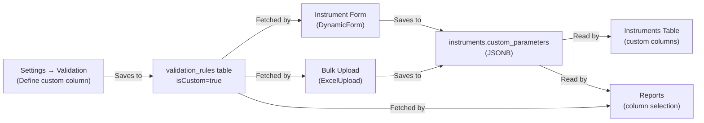

# CRD V4 Gap Analysis & Implementation Plan

Customer Requirement Document (CRD) gap analysis against the existing GaugeMaster codebase, with a plan to implement **only the missing features** without affecting existing business logic.

---

## Gap Analysis Summary

### CRD Requirement → Current Status

| # | Requirement | Status | Details |
|---|-------------|--------|---------|
| **2.1** | Multi-location support | ✅ **EXISTS** | `location` field on [instrument.entity.ts](file:///d:/Gaugemaster/gaugemaster/backend/src/instruments/instrument.entity.ts#L33) — instruments can be filtered/grouped by location in dashboard, reports, and list pages. |
| **2.2** | Location → Email mapping (Location Head) | ❌ **MISSING** | No `location_emails` or Location Head entity. Current reminders use role-based recipients (`juniorRecipients`, `seniorRecipients`, `supervisorRecipients`) in [setting.entity.ts](file:///d:/Gaugemaster/gaugemaster/backend/src/settings/entities/setting.entity.ts#L29-L38), not location-specific emails. |
| **2.3** | "15 Days for Due" — daily reminder to Location Head | ⚠️ **PARTIAL** | Reminder system exists via [reminder.service.ts](file:///d:/Gaugemaster/gaugemaster/backend/src/reminder/reminder.service.ts) using PgBoss scheduler. Supports "before" reminders with configurable days. BUT: reminders go to role-based recipients, not to Location Head email. **No location-aware routing.** |
| **2.4** | "Overdue" — daily reminder until status changes | ⚠️ **PARTIAL** | Overdue auto-detection exists via [instruments.service.ts cron](file:///d:/Gaugemaster/gaugemaster/backend/src/instruments/instruments.service.ts#L589-L623). BUT: no daily reminder is sent to Location Head when status = Overdue. The cron only updates the status, it does not trigger recurring email. |
| **2.5** | "Sent for Calibration" — stop reminders | ⚠️ **PARTIAL** | Status "Sent for Calibration" exists in the frontend [InstrumentForm.tsx](file:///d:/Gaugemaster/gaugemaster/frontend/src/pages/InstrumentForm.tsx#L25-L37). BUT: the backend reminder engine does NOT check instrument status before sending — it sends based solely on schedule. No suppression logic. |
| **2.6** | "Calibrated" — notify Location Head to collect | ❌ **MISSING** | No notification is triggered when an instrument transitions to "Calibrated/OK" status. No "collection" notification to the Location Head. |
| **3.1** | Continuous Certificate Upload | ✅ **EXISTS** | Certificate upload endpoint at [instruments.controller.ts](file:///d:/Gaugemaster/gaugemaster/backend/src/instruments/instruments.controller.ts#L107-L133). Calibration certificates stored via calibration module in [calibration.controller.ts](file:///d:/Gaugemaster/gaugemaster/backend/src/calibration/calibration.controller.ts). |
| **3.2** | Digital Archive (retain all old certificates) | ✅ **EXISTS** | [calibration-history.entity.ts](file:///d:/Gaugemaster/gaugemaster/backend/src/instruments/calibration-history.entity.ts) stores `certificate_file` per calibration. Each calibration generates a history record. Old certificates are retained. |
| **3.3** | History Card — view & download full calibration history | ✅ **EXISTS** | [CalibrationHistory.tsx](file:///d:/Gaugemaster/gaugemaster/frontend/src/pages/CalibrationHistory.tsx) page exists. Shows calibration records, audit logs, certificate preview, and download. Endpoint: `GET /instruments/:id/history`. |
| **4.1** | Bulk Upload — extra columns per customer format | ⚠️ **PARTIAL** | Bulk upload exists via [ExcelUpload.tsx](file:///d:/Gaugemaster/gaugemaster/frontend/src/components/ExcelUpload.tsx) and [instruments.controller.ts](file:///d:/Gaugemaster/gaugemaster/backend/src/instruments/instruments.controller.ts#L142-L147). Template has 30 columns. **Custom columns feature needed** (see Feature 5 below). |
| **4.2** | Customized Downloads — Date Range, Status, Location filters | ⚠️ **PARTIAL** | Report generation supports date range & column selection ([reports.service.ts](file:///d:/Gaugemaster/gaugemaster/backend/src/reports/reports.service.ts#L332-L353)). Preview endpoint supports name/id_code/location/agency/status filtering. BUT: **download endpoint does NOT accept status or location filters** — it only filters by date range. |
| **4.3** | Branding — Goodluck logo & company name on PDFs/Excel | ✅ **EXISTS** | Report template system supports custom header/footer with logos and company branding. Templates configurable via [report-templates](file:///d:/Gaugemaster/gaugemaster/backend/src/report-templates) module and user settings `reportConfig`. |
| **4.4** | Automated Summary — email to management with counts | ❌ **MISSING** | No automated summary report email exists. No cron job sends periodic (daily/weekly) summary counts of "Due", "Ongoing Calibration", and "Completed" to management. |
| **5.1** | DB: Location-to-Email mapping | ❌ **MISSING** | No database table or entity for mapping locations to email addresses. |
| **5.2** | Background scheduler (Cron) for daily email | ✅ **EXISTS** | PgBoss-based scheduler in [reminder.service.ts](file:///d:/Gaugemaster/gaugemaster/backend/src/reminder/reminder.service.ts). NestJS `@Cron` in [instruments.service.ts](file:///d:/Gaugemaster/gaugemaster/backend/src/instruments/instruments.service.ts#L590). `@nestjs/schedule` is already a dependency. |
| **5.3** | Branding in reporting engine | ✅ **EXISTS** | See 4.3 above. |
| **5.4** | CSV/Excel parser adjustment | ⚠️ **PARTIAL** | Parser exists but needs custom column support (see Feature 5). |

---

## Features to Implement

---

### Feature 1: Location-to-Email Mapping (Location Head Registry)

> **CRD Sections: 2.2, 5.1**

#### [NEW] `location-email.entity.ts` — `backend/src/settings/entities/location-email.entity.ts`
- New entity `LocationEmail` with: `id`, `companyId`, `location` (string), `emailId` (string — Location Head email), `name` (string — Location Head name, optional), `created_at`, `updated_at`.
- Unique constraint on `(companyId, location)` to prevent duplicate mappings.

#### [MODIFY] [settings.module.ts](file:///d:/Gaugemaster/gaugemaster/backend/src/settings/settings.module.ts)
- Register `LocationEmail` entity in TypeORM imports.

#### [MODIFY] [settings.service.ts](file:///d:/Gaugemaster/gaugemaster/backend/src/settings/settings.service.ts)
- Add CRUD methods: `getLocationEmails(companyId)`, `upsertLocationEmail(data)`, `deleteLocationEmail(id)`.

#### [MODIFY] [settings.controller.ts](file:///d:/Gaugemaster/gaugemaster/backend/src/settings/settings.controller.ts)
- Add new endpoints:
  - `GET /api/settings/location-emails?companyId=X` — list all location→email mappings.
  - `POST /api/settings/location-emails` — create/update a mapping.
  - `DELETE /api/settings/location-emails/:id` — delete a mapping.

#### [NEW] Frontend: Location Email Settings UI
- Add a new section/tab in the existing Settings page to manage location→email mappings.
- Table with columns: Location, Location Head Name, Email, Actions (Edit/Delete).
- Add/Edit form with Location (dropdown from existing locations), Name, Email.

#### [NEW] Migration
- Database migration to create `location_emails` table.

---

### Feature 2: Status-Driven Notification Logic

> **CRD Sections: 2.3, 2.4, 2.5, 2.6**

#### [NEW] `status-notification.service.ts` — `backend/src/reminder/status-notification.service.ts`
A new service that runs as a **daily cron job** and implements the CRD's 4-status notification logic:

1. **15 Days for Due**: Query instruments where `due_date` is within 15 days from today. Look up Location Head email via `LocationEmail` entity. Send daily reminder to Location Head.
2. **Overdue**: Query instruments where `due_date < today` AND `status != 'Sent for Calibration'`. Send daily reminder to Location Head until status changes.
3. **Sent for Calibration**: Skip any instrument with this status — no automated reminders.
4. **Calibrated**: This is an **event-driven** notification, not cron-based. Triggered when calibration is completed.

> [!IMPORTANT]
> This is a **separate** cron job from the existing reminder system. The existing `ReminderService` handles user-configured custom reminders. This new service implements the **CRD-specific** fixed notification rules. Both coexist without conflict.

#### [MODIFY] [reminder.service.ts](file:///d:/Gaugemaster/gaugemaster/backend/src/reminder/reminder.service.ts)
- Add a check in `processSingleReminder()`: If the instrument's current status is `"Sent for Calibration"`, skip sending the email.

#### [MODIFY] Calibration completion flow
- In the calibration completion flow (where status changes to "OK"/"Calibrated"), call `StatusNotificationService` to send a "Calibrated — please collect" notification to the Location Head.

#### [MODIFY] [reminder.module.ts](file:///d:/Gaugemaster/gaugemaster/backend/src/reminder/reminder.module.ts)
- Register the new `StatusNotificationService`.
- Import `LocationEmail` entity repository.

---

### Feature 3: Report Downloads with Status & Location Filters

> **CRD Section: 4.2**

#### [MODIFY] [reports.controller.ts](file:///d:/Gaugemaster/gaugemaster/backend/src/reports/reports.controller.ts)
- Add `@Query('status')` and `@Query('location')` parameters to the `getReport()` endpoint.
- Pass these filters through to `generateReport()`.

#### [MODIFY] [reports.service.ts](file:///d:/Gaugemaster/gaugemaster/backend/src/reports/reports.service.ts)
- Update `generateReport()` method to accept optional `status` and `location` filter parameters.
- Apply `ILike` filters to the instrument query.

#### [MODIFY] [Reports.tsx](file:///d:/Gaugemaster/gaugemaster/frontend/src/pages/Reports.tsx)
- Add Status and Location filter dropdowns.
- Pass selected status/location filters when generating/downloading reports.
- Add preset date range buttons: "Monthly", "Quarterly", "Yearly".

---

### Feature 4: Automated Summary Report to Management

> **CRD Section: 4.4**

#### [NEW] `summary-report.service.ts` — `backend/src/reports/summary-report.service.ts`
- A new service with a daily `@Cron` job.
- For each company, queries counts of "Due", "Ongoing Calibration", and "Completed" instruments.
- Sends a summary HTML email using the existing `MailerService`.

#### [MODIFY] [reports.module.ts](file:///d:/Gaugemaster/gaugemaster/backend/src/reports/reports.module.ts)
- Register the new `SummaryReportService`.

#### [MODIFY] [setting.entity.ts](file:///d:/Gaugemaster/gaugemaster/backend/src/settings/entities/setting.entity.ts)
- Add optional `managementRecipients: string[]`, `summaryReportEnabled: boolean`, `summaryReportFrequency: string` fields.

#### [MODIFY] Frontend Settings UI
- Add a "Summary Report" configuration section in settings.

---

### Feature 5: Custom Columns for Instrument Form & Bulk Upload

> **CRD Section: 4.1, 5.4 + User Request**

This feature lets users define **custom columns** (via Settings → Validation) that behave exactly like built-in default columns across the entire system: Instrument Form, Instruments Table, Bulk Upload (template download + Excel parsing + validation), and Reports.

#### Architecture Decision

> [!NOTE]
> The instrument entity already has a `custom_parameters` JSONB column ([instrument.entity.ts:L116-117](file:///d:/Gaugemaster/gaugemaster/backend/src/instruments/instrument.entity.ts#L116-L117)) specifically designed for dynamic extra fields. **No database migration is needed.** Custom column values will be stored as keys inside this JSON field.
>
> Custom column definitions will be stored in the existing `validation_rules` table ([validation-rule.entity.ts](file:///d:/Gaugemaster/gaugemaster/backend/src/validation/validation-rule.entity.ts)) with a new `isCustom: boolean` flag. This way, custom columns automatically participate in the existing validation pipeline.

#### Data Flow



---

#### Backend Changes

##### [MODIFY] [validation-rule.entity.ts](file:///d:/Gaugemaster/gaugemaster/backend/src/validation/validation-rule.entity.ts)
Add two new columns to differentiate custom fields and store Excel aliases:
```diff
+ @Column({ default: false })
+ isCustom: boolean;  // true = user-defined custom column, false = built-in default
+
+ @Column({ type: 'simple-array', nullable: true })
+ excelAliases: string[];  // e.g. ["Vendor Code", "Vendor ID"] — alternative names for bulk upload matching
```

##### [MODIFY] [validation.service.ts](file:///d:/Gaugemaster/gaugemaster/backend/src/validation/validation.service.ts)
- **`getRules()`**: Already returns all rules. No change needed — custom rules will automatically be included.
- **`validateData()`**: Already validates dynamically based on rules. Add logic: for rules where `isCustom === true`, validate against `data.custom_parameters[rule.fieldName]` instead of `data[rule.fieldName]`.
- **Add `addCustomField()`**: New method to create a custom column rule:
  ```typescript
  async addCustomField(companyId: string, data: {
    fieldName: string;      // Internal key, e.g. "vendor_code"
    displayName: string;    // UI label, e.g. "Vendor Code"
    validationType: string; // "text" | "number" | "date"
    isRequired: boolean;
    excelAliases?: string[];
  })
  ```
- **Add `deleteCustomField()`**: Deletes a custom rule (only if `isCustom === true`). Default fields cannot be deleted.

##### [MODIFY] [validation.controller.ts](file:///d:/Gaugemaster/gaugemaster/backend/src/validation/validation.controller.ts)
- Add `POST /api/validation/custom-field` — create a new custom column.
- Add `DELETE /api/validation/custom-field/:id` — delete a custom column (only custom, not default).

##### [MODIFY] [instruments.service.ts](file:///d:/Gaugemaster/gaugemaster/backend/src/instruments/instruments.service.ts)
- **`create()`**: When saving, extract custom field values from the incoming DTO's `custom_parameters` object. The `...instrumentDto` spread already includes `custom_parameters`, so this is handled automatically by the existing code.
- **`update()`**: Same — `custom_parameters` is part of the merge payload. Already works.
- **`bulkUpload()`**: Already calls `create()` which handles `custom_parameters`. No change needed.

##### [MODIFY] [create-instrument.dto.ts](file:///d:/Gaugemaster/gaugemaster/backend/src/dto/create-instrument.dto.ts)
- The `custom_parameters` field already exists and is `@IsOptional()`. No change needed.

---

#### Frontend Changes

##### [MODIFY] [ValidationSettings.tsx](file:///d:/Gaugemaster/gaugemaster/frontend/src/pages/settings/ValidationSettings.tsx)
Add an **"Add Custom Column"** section below the existing validation rules:
- **"Add Custom Column" button** → opens a form with:
  - `Field Name` (internal key, auto-generated from Display Name as snake_case, e.g. "Vendor Code" → "vendor_code")
  - `Display Name` (user-visible label)
  - `Type` (dropdown: Text / Number / Date)
  - `Required` toggle
  - `Excel Column Aliases` (comma-separated alternative names for bulk upload matching)
- Custom columns listed with a **Delete** button (default fields cannot be deleted).
- Custom columns shown with a `Custom` badge to distinguish them from defaults.

##### [MODIFY] [InstrumentForm.tsx](file:///d:/Gaugemaster/gaugemaster/frontend/src/pages/InstrumentForm.tsx)
- After fetching `validationRules`, filter for `isCustom === true` rules.
- Dynamically generate additional `FormFieldConfig[]` entries for each custom rule:
  ```typescript
  const customFields: FormFieldConfig[] = validationRules
    .filter(r => r.isCustom)
    .map(r => ({
      name: `custom_param_${r.fieldName}`,  // prefix to avoid clashes with default fields
      label: r.displayName,
      type: r.validationType === 'number' ? 'number' : r.validationType === 'date' ? 'date' : 'text',
      col: 4,
    }));
  ```
- Merge into `INSTRUMENT_FIELDS` and pass to `DynamicForm`.
- On submit, extract `custom_param_*` fields from values and pack into `custom_parameters`:
  ```typescript
  const custom_parameters: Record<string, any> = {};
  validationRules.filter(r => r.isCustom).forEach(r => {
    custom_parameters[r.fieldName] = values[`custom_param_${r.fieldName}`] || "";
  });
  payload.custom_parameters = custom_parameters;
  ```
- On edit load, unpack `custom_parameters` back into form default values.

##### [MODIFY] [Instruments.tsx](file:///d:/Gaugemaster/gaugemaster/frontend/src/pages/Instruments.tsx)
- After fetching validation rules, generate extra `ColumnConfig[]` entries for custom columns.
- Append to `DEFAULT_INSTRUMENT_COLUMNS` dynamically.
- In the table column definitions, for each custom column, render `instrument.custom_parameters?.[fieldName]`.

##### [MODIFY] [ExcelUpload.tsx](file:///d:/Gaugemaster/gaugemaster/frontend/src/components/ExcelUpload.tsx)
- **Template download** (`downloadTemplate()`): Append custom column headers (from validation rules where `isCustom === true`) to the template.
- **Validation** (`validateRow()`): Already loops through `validationRules` and checks `isRequired`. Custom rules will automatically be validated since they're in the same rules array. Need to check `mapped.custom_parameters?.[rule.fieldName]` for custom fields.

##### [MODIFY] [Instruments.tsx mapRow](file:///d:/Gaugemaster/gaugemaster/frontend/src/pages/Instruments.tsx#L1724-L1766) (Bulk Upload)
- After mapping default fields, loop through custom validation rules and populate `custom_parameters`:
  ```typescript
  const custom_parameters: Record<string, any> = {};
  customRules.forEach(rule => {
    const val = getVal([rule.displayName, ...(rule.excelAliases || [])]);
    if (val !== undefined) custom_parameters[rule.fieldName] = val;
  });
  return { ...defaultMapped, custom_parameters };
  ```

##### [MODIFY] [Reports.tsx](file:///d:/Gaugemaster/gaugemaster/frontend/src/pages/Reports.tsx)
- Fetch validation rules and add custom columns to the column visibility/selection UI.

##### [MODIFY] [reports.service.ts](file:///d:/Gaugemaster/gaugemaster/backend/src/reports/reports.service.ts)
- In `generateReport()` / `generatePdfReport()` / `generateHtmlReport()`: when processing columns, check if a column key starts with `custom_` and read from `instrument.custom_parameters[key]` instead of `instrument[key]`.

---

#### What This Achieves

| Surface | Custom Column Behavior |
|---------|----------------------|
| **Settings → Validation** | User creates/deletes custom columns with name, type, required flag, and Excel aliases |
| **Instrument Form** | Custom columns appear as regular form fields with full validation (required, type) |
| **Instruments Table** | Custom columns appear as togglable columns, showing `custom_parameters` values |
| **Bulk Upload Template** | Downloaded template includes custom column headers |
| **Bulk Upload Parsing** | Excel parser maps columns by `displayName` + `excelAliases` → `custom_parameters` |
| **Bulk Upload Validation** | Required/type validation applied to custom columns same as default columns |
| **Reports** | Custom columns available in column selection for PDF/Excel/HTML export |

---

## Open Questions

> [!IMPORTANT]
> **Q1**: For the Automated Summary Report (Feature 4), should the management email recipients be:
> - (a) The existing `supervisorRecipients` from settings?
> - (b) A new separate `managementRecipients` list?
> - (c) Configurable per location?

> [!IMPORTANT]
> **Q2**: For the "15 Days for Due" reminder — should the 15-day threshold be a configurable value (per company), or fixed at exactly 15 days?

> [!IMPORTANT]
> **Q3**: For the "Calibrated — collect from lab" notification, should this trigger automatically when a calibration certificate is generated, or when the instrument status manually changes to "OK"?

---

## Summary of Changes (No Existing Logic Affected)

| Scope | What Changes | What Stays Untouched |
|-------|-------------|---------------------|
| **Reminder System** | New `StatusNotificationService` cron alongside existing. One small guard added to skip "Sent for Calibration" in existing handler. | Existing reminder configuration, scheduling, PgBoss jobs, templates, bulk/single modes — all preserved. |
| **Reports** | Add status/location filter params to download endpoint. Add custom column support. | Existing date range, column selection, template system, PDF/Excel/HTML generation — all preserved. |
| **Settings** | New `LocationEmail` entity. New fields for summary report config. | Existing SMTP, recipient lists, theme, report config, certificate config — all preserved. |
| **Validation** | Add `isCustom` and `excelAliases` columns to `validation_rules`. New add/delete custom field endpoints. | Existing validation logic, default field rules, `isRequired`/`isUnique`/`isStrictDate` behavior — all preserved. |
| **Instruments** | Custom columns rendered dynamically in form, table, and bulk upload. Values stored in existing `custom_parameters` JSONB. | Instrument entity schema, CRUD operations, bulk upload pipeline, search, status auto-update — all preserved. |
| **Calibration** | Add one notification call on calibration completion. | Certificate generation, calibration wizard, templates, audit logs — all preserved. |

---

## Verification Plan

### Automated Tests
- `npm run test` for existing backend test suites to confirm no regressions.
- Add unit tests for `StatusNotificationService` and `SummaryReportService`.
- Add unit tests for custom field validation in `ValidationService`.

### Manual Verification
1. **Custom Columns**: Create a custom column "Vendor Code" (text, required) in Settings → Validation. Verify it appears in Instrument Form, Instruments Table, downloaded Bulk Upload template, and is validated during bulk upload.
2. **Location Emails**: Create location→email mappings, verify persistence.
3. **Notifications**: Set up instruments with various statuses and verify notification behavior.
4. **Reports**: Generate a report with status and location filters, verify filtered output.
5. **Bulk Upload**: Upload an Excel file with custom column data, verify `custom_parameters` is populated correctly.
6. **Existing Flow**: Verify existing reminder system, calibration wizard, and all existing features continue to work unchanged.
